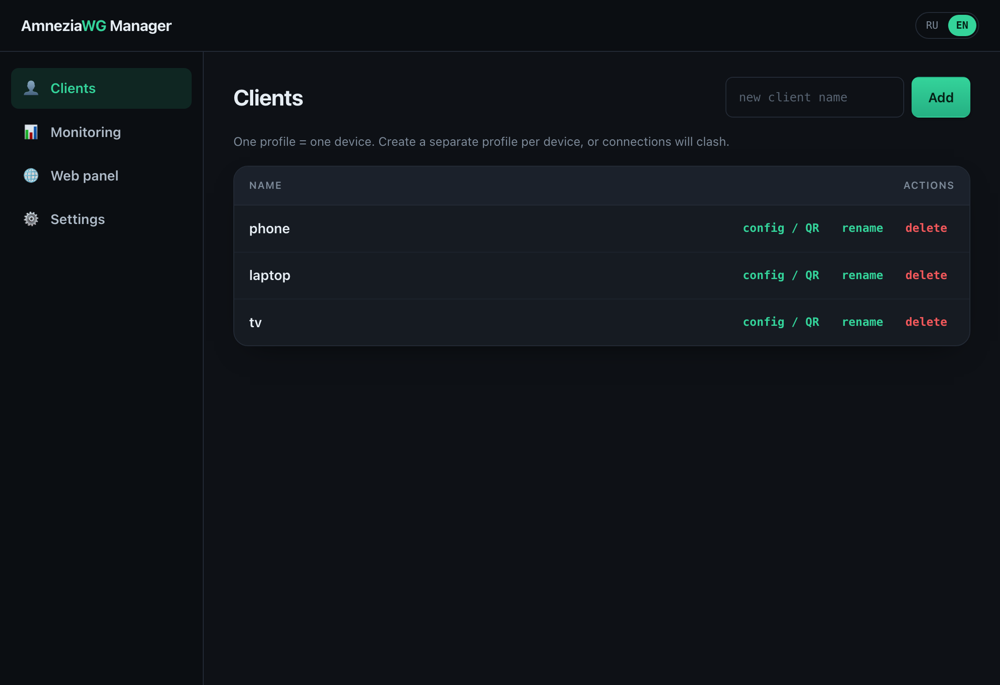
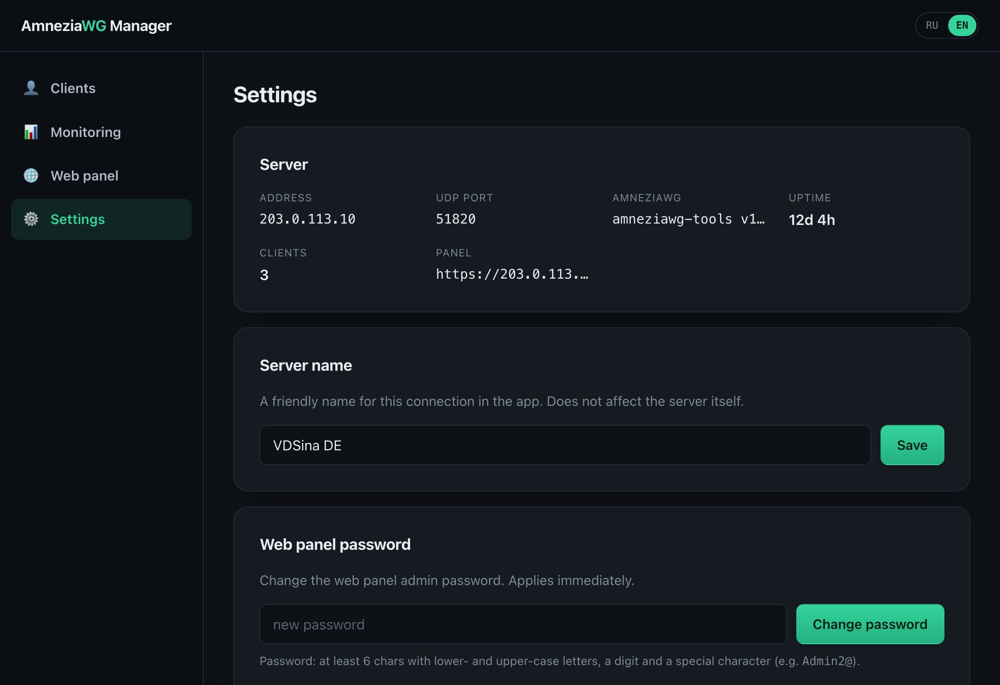
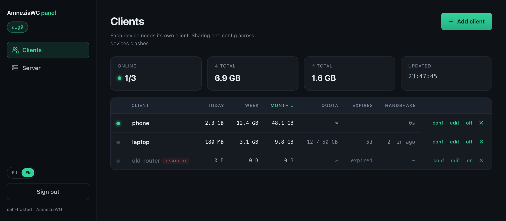
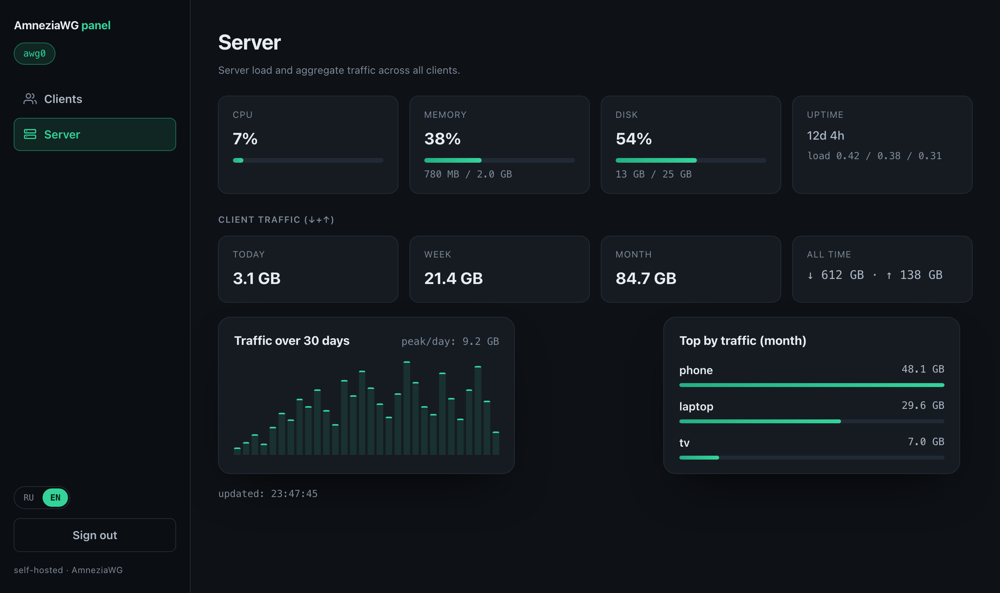

# AmneziaWG Installer

**English** · [Русский](README.ru.md)

> Set up your own **AmneziaWG** VPN on a Linux server — with a desktop app, a
> one-line command, or a script on the server. No Linux knowledge required.


AmneziaWG is a fork of **WireGuard** with built-in traffic obfuscation: it
disguises the handshake and packet headers so DPI systems can't fingerprint and
block it. This project removes all the manual work — install, NAT/firewall,
randomized obfuscation, client management with QR codes.

## What you need

1. **A cheap VPS** running **Ubuntu 22.04+/24.04 or Debian 12+** (any hosting
   provider). You'll need its **IP address**, a **user** (usually `root`) and the
   **password**. No server yet? You can rent one at
   [VDSina](https://www.vdsina.com/?partner=7yhz21p6dkml) or
   [HSHP](https://hshp.host/?from=144227) _(referral links — they help support the project)_.
2. **The AmneziaWG app** on your phone/PC to connect:
   - **iOS** — [App Store](https://apps.apple.com/app/amneziawg/id6478942365)
   - **Android / Windows / macOS / Linux** — [amnezia.org/downloads](https://amnezia.org/downloads)

That's it. The server is tuned for reliable connections out of the box — there's
nothing to choose.

## Install — pick one way

### 1. Desktop app (easiest, point & click) 🖱️

A native app for **Windows** and **macOS** — no terminal at all.

1. Download **AmneziaWG Manager** for your computer from
   [Releases](https://github.com/hennessyxo/amneziawg-installer/releases/latest)
   (`awg-gui` — `.app` for macOS, `.exe` for Windows).
2. Open it, enter your server **IP + password**, click **Install**.
3. Add clients, show their **QR / config**, monitor live traffic, and install or
   open the web panel — all with buttons. A **Settings** tab shows server info
   (IP, port, version, uptime, clients), renames the connection, changes the web
   panel password, or removes the panel / AmneziaWG. See [`gui/`](gui/).

> Tick **"Remember password"** to skip typing it next time — it's stored in your
> OS keychain (macOS Keychain / Windows Credential Manager), never in a file.

| Manage clients | Settings (server info, password, danger zone) |
|:---:|:---:|
|  |  |

### 2. From your computer (command line) ⌨️

A single cross-platform binary `awg-deploy` that drives the server over SSH.

1. Download it for **your computer** from
   [Releases](https://github.com/hennessyxo/amneziawg-installer/releases/latest):

   | Your computer | File |
   |---------------|------|
   | Windows | `awg-deploy-windows-amd64.exe` |
   | macOS — Apple Silicon (M1–M5) | `awg-deploy-darwin-arm64.tar.gz` |
   | macOS — Intel | `awg-deploy-darwin-amd64.tar.gz` |
   | Linux — x86_64 / ARM | `awg-deploy-linux-amd64.tar.gz` / `-arm64.tar.gz` |

2. **Run it with no arguments** — it asks for your server IP + password, connects
   over SSH and runs the installer + management menu **on the server**:

   ```bash
   ./awg-deploy            # macOS/Linux  (Windows: double-click or .\awg-deploy-windows-amd64.exe)
   ```

3. (Advanced) direct commands for scripting:
   ```bash
   awg-deploy install       root@SERVER_IP
   awg-deploy add-client    root@SERVER_IP laptop
   awg-deploy list          root@SERVER_IP
   awg-deploy remove-client root@SERVER_IP laptop
   awg-deploy uninstall     root@SERVER_IP
   ```

See [`docs/DEPLOY.md`](docs/DEPLOY.md).

### 3. Directly on the server 🐧

SSH into the server and run, as root:

```bash
git clone https://github.com/hennessyxo/amneziawg-installer.git
cd amneziawg-installer
sudo bash amneziawg-install.sh        # add --lang en for English UI
```

Answer a few questions (IP, port, DNS, first client) and scan the QR in the
**AmneziaWG** app. Re-run the script anytime for the management menu: add/remove
clients, **monitoring** (option 6), **web panel** (option 7).

**Non-interactive** (automation):
```bash
AWG_SERVER_IP=SERVER_IP AWG_CLIENT=phone sudo -E bash amneziawg-install.sh --yes
sudo bash amneziawg-install.sh --add-client laptop
```
Vars: `AWG_SERVER_IP`, `AWG_PORT` (blank = free random), `AWG_DNS1/2`,
`AWG_CLIENT`, `AWG_LANG` (`ru|en`).

## Nuances & gotchas

- **Unsigned apps.** The GUI and `awg-deploy` aren't code-signed, so the OS warns
  the first time:
  - **macOS** — the first launch is blocked. Double-click, dismiss the warning,
    then **System Settings → Privacy & Security → Open Anyway** (once). On older
    macOS: right-click → **Open**. The GUI zip includes a short text guide.
  - **Windows** — SmartScreen → **More info → Run anyway**.
- **Cloud firewall.** If your provider has its own firewall (AWS/GCP/Oracle…),
  open the VPN's **UDP port** there too. The installer opens the local firewall
  itself and now picks a **free** port automatically (won't collide with other
  services).
- **One profile = one device.** Create a separate client for each phone/PC, or
  their connections will clash.
- **Web panel cert.** The panel uses a self-signed TLS cert, so the browser warns
  once — that's expected; traffic is still encrypted. Don't expose it to the
  public internet without need (use an SSH tunnel / trusted network).
- **OpenVZ** VPSs are not supported (no kernel modules) — use KVM.

## Monitoring & web panel

- **`awg-monitor`** — live terminal dashboard (traffic, rates, handshake, online).
  Menu option 6, or build: `go build -o awg-monitor ./cmd/awg-monitor`. See
  [`docs/MONITOR.md`](docs/MONITOR.md).
- **`awg-panel`** — browser dashboard (Go + htmx): auth (bcrypt + HTTPS), live
  traffic, per-client usage over **day / week / month** (sortable), client
  management, and **traffic quotas, time-based expiry and per-client speed limits**
  enforced by a background daemon. A **Server** page shows host load (CPU / RAM /
  disk / uptime), aggregate client traffic over time, a 30-day chart and the top
  clients. Menu option 7 (or the GUI's "Install web panel" button). See
  [`docs/PANEL.md`](docs/PANEL.md).

| Web panel — clients & usage | Web panel — server overview |
|:---:|:---:|
|  |  |

## Security notes

- Private keys, params and the panel password hash are stored `600` under `umask 077`.
- Each client gets a unique preshared key; obfuscation parameters are randomized per install.
- The desktop app keeps the SSH password only in memory (or the OS keychain if you
  opt in) — never in a project file.
- SSH host keys are verified via `known_hosts` (trust-on-first-use, hard-fail on a changed key).

## Troubleshooting

See [`docs/TROUBLESHOOTING.md`](docs/TROUBLESHOOTING.md). Quick checks:

```bash
systemctl status awg-quick@awg0
journalctl -u awg-quick@awg0 -n 50
awg show awg0
```

## Disclaimer

For **lawful** use — privacy, accessing your own resources, and learning
networking. Follow the laws of your jurisdiction.

## ☕ Support

If this project saved you time, you can support its development on
[Boosty](https://boosty.to/hennessyxo/donate). Thanks!

## License

MIT © contributors. See [LICENSE](LICENSE). Install logic adapted from the
battle-tested [`angristan/wireguard-install`](https://github.com/angristan/wireguard-install)
and ported to AmneziaWG with obfuscation support.
