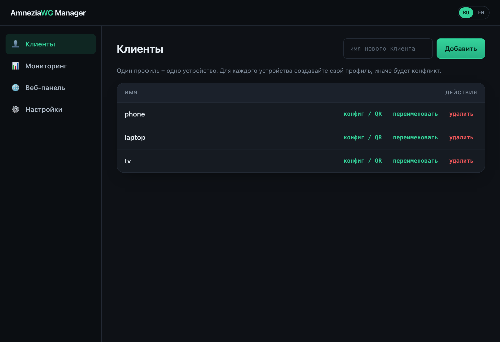
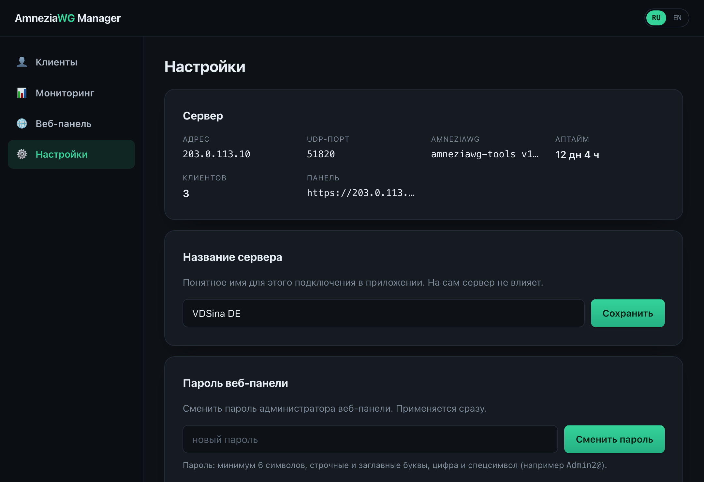
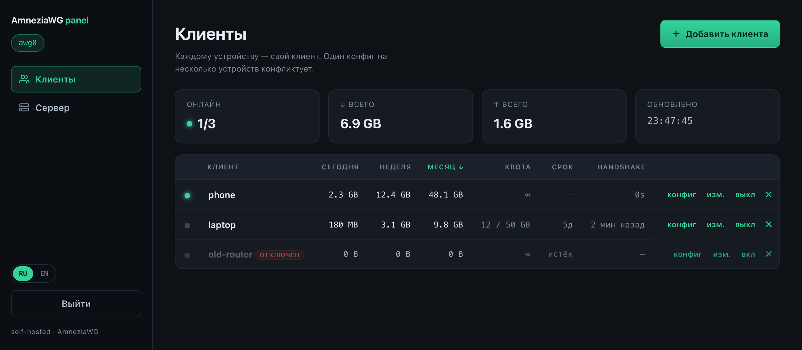
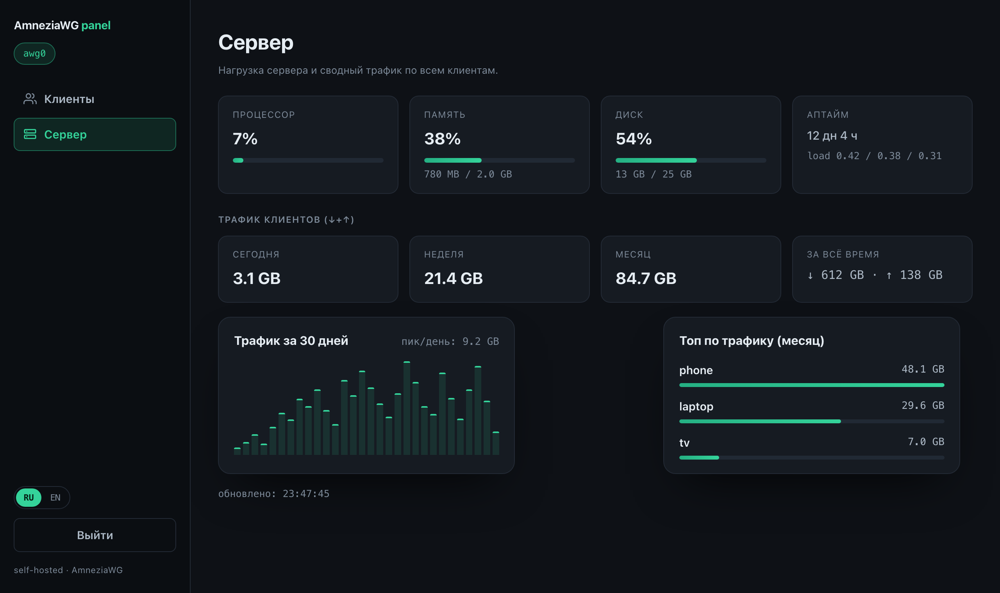

# AmneziaWG Installer

**Русский** · [English](README.en.md)

> Поднимите свой **AmneziaWG** VPN на Linux-сервере — через приложение, одну
> команду или скрипт на сервере. Знания Linux не нужны.


AmneziaWG — это форк **WireGuard** со встроенной маскировкой трафика: он прячет
рукопожатие и заголовки пакетов, чтобы DPI-системы не могли его распознать и
заблокировать. Проект убирает всю ручную работу — установку, NAT/файрвол,
случайную обфускацию, управление клиентами с QR-кодами.

## Что нужно

1. **Дешёвый VPS** с **Ubuntu 22.04+/24.04 или Debian 12+** (любой хостинг).
   Понадобятся его **IP-адрес**, **пользователь** (обычно `root`) и **пароль**.
   Нет сервера? Можно арендовать на
   [VDSina](https://www.vdsina.com/?partner=7yhz21p6dkml) или
   [HSHP](https://hshp.host/?from=144227) _(партнёрские ссылки — поддерживают проект)_.
2. **Приложение AmneziaWG** на телефоне/ПК для подключения — берите из любого источника:
   - **iOS** — [App Store](https://apps.apple.com/app/amneziawg/id6478942365) · [GitHub](https://github.com/amnezia-vpn/amneziawg-apple/releases)
   - **Android** — [Google Play](https://play.google.com/store/apps/details?id=org.amnezia.awg) · [GitHub](https://github.com/amnezia-vpn/amneziawg-android/releases)
   - **Windows** — [GitHub](https://github.com/amnezia-vpn/amneziawg-windows-client/releases)
   - **macOS** — [App Store](https://apps.apple.com/app/amneziawg/id6478942365) · [GitHub](https://github.com/amnezia-vpn/amneziawg-apple/releases)
   - **Все клиенты / исходники** — [github.com/amnezia-vpn](https://github.com/amnezia-vpn) · [amnezia.org](https://amnezia.org/downloads)

И всё. Сервер сразу настроен на стабильное соединение — выбирать ничего не нужно.

## Установка — выберите один способ

### 1. Приложение (проще всего, мышкой) 🖱️

Нативное приложение для **Windows** и **macOS** — вообще без терминала.

1. **Скачайте AmneziaWG Manager** — прямая ссылка, всегда последний релиз:
   ### ⬇ [macOS](https://github.com/hennessyxo/amneziawg-installer/releases/latest/download/awg-gui-macos.zip) · [Windows](https://github.com/hennessyxo/amneziawg-installer/releases/latest/download/awg-gui-windows-amd64.exe)
   _(или посмотреть [все файлы](https://github.com/hennessyxo/amneziawg-installer/releases/latest))_
2. Откройте, введите **IP сервера + пароль**, нажмите **Установить**.
3. Добавляйте клиентов, показывайте их **QR / конфиг**, следите за трафиком,
   ставьте или открывайте веб-панель — кнопками. Вкладка **«Настройки»**
   показывает данные сервера (IP, порт, версию, аптайм, число клиентов),
   переименовывает подключение, меняет пароль веб-панели или удаляет панель /
   AmneziaWG. Подробнее в [`gui/`](gui/).

> Галочка **«Запомнить пароль»** избавит от повторного ввода — пароль хранится в
> системном хранилище (Keychain / Credential Manager), а не в файле.

| Управление клиентами | Настройки (инфо о сервере, пароль, опасная зона) |
|:---:|:---:|
|  |  |

Установить **Telegram-бота** можно прямо из приложения — токен, разрешённые ID и
пароль, с пошаговой инструкцией прямо в окне:

<p align="center"></p>

### 2. С компьютера (командная строка) ⌨️

Один кросс-платформенный бинарник `awg-deploy`, который управляет сервером по SSH.

1. Скачайте его для **своего компьютера** (прямые ссылки, всегда последний релиз):

   | Ваш компьютер | Скачать |
   |---------------|---------|
   | Windows | [`awg-deploy-windows-amd64.exe`](https://github.com/hennessyxo/amneziawg-installer/releases/latest/download/awg-deploy-windows-amd64.exe) |
   | macOS — Apple Silicon (M1–M5) | [`awg-deploy-darwin-arm64.tar.gz`](https://github.com/hennessyxo/amneziawg-installer/releases/latest/download/awg-deploy-darwin-arm64.tar.gz) |
   | macOS — Intel | [`awg-deploy-darwin-amd64.tar.gz`](https://github.com/hennessyxo/amneziawg-installer/releases/latest/download/awg-deploy-darwin-amd64.tar.gz) |
   | Linux | [`amd64`](https://github.com/hennessyxo/amneziawg-installer/releases/latest/download/awg-deploy-linux-amd64.tar.gz) / [`arm64`](https://github.com/hennessyxo/amneziawg-installer/releases/latest/download/awg-deploy-linux-arm64.tar.gz) |

2. **Запустите без аргументов** — спросит IP сервера и пароль, подключится по SSH
   и запустит установщик с меню управления **прямо на сервере**:

   ```bash
   ./awg-deploy            # macOS/Linux  (Windows: двойной клик или .\awg-deploy-windows-amd64.exe)
   ```

3. (Для продвинутых) прямые команды для скриптов:
   ```bash
   awg-deploy install       root@IP_СЕРВЕРА
   awg-deploy add-client    root@IP_СЕРВЕРА laptop
   awg-deploy list          root@IP_СЕРВЕРА
   awg-deploy remove-client root@IP_СЕРВЕРА laptop
   awg-deploy uninstall     root@IP_СЕРВЕРА
   ```

Подробнее — [`docs/DEPLOY.ru.md`](docs/DEPLOY.ru.md).

### 3. Прямо на сервере 🐧

Зайдите на сервер по SSH и выполните от root:

```bash
git clone https://github.com/hennessyxo/amneziawg-installer.git
cd amneziawg-installer
sudo bash amneziawg-install.sh
```

Ответьте на пару вопросов (IP, порт, DNS, первый клиент) и отсканируйте QR в
приложении **AmneziaWG**. Запускайте скрипт снова для меню управления:
добавить/удалить клиентов, **мониторинг** (пункт 6), **веб-панель** (пункт 7).

**Неинтерактивно** (автоматизация):
```bash
AWG_SERVER_IP=IP_СЕРВЕРА AWG_CLIENT=phone sudo -E bash amneziawg-install.sh --yes
sudo bash amneziawg-install.sh --add-client laptop
```
Переменные: `AWG_SERVER_IP`, `AWG_PORT` (пусто = свободный случайный),
`AWG_DNS1/2`, `AWG_CLIENT`, `AWG_LANG` (`ru|en`).

## Нюансы и сложности

- **Приложения без подписи.** GUI и `awg-deploy` не подписаны, поэтому ОС
  предупредит при первом запуске:
  - **macOS** — первый запуск блокируется. Дважды кликните, закройте
    предупреждение, затем **Системные настройки → Конфиденциальность и
    безопасность → «Открыть всё равно»** (один раз). На старых macOS: правый
    клик → **Открыть**. В архиве с приложением есть текстовая памятка.
  - **Windows** — SmartScreen → **Подробнее → Выполнить в любом случае**.
- **Облачный файрвол.** Если у провайдера свой файрвол (AWS/GCP/Oracle…),
  откройте **UDP-порт** VPN и там. Локальный файрвол установщик открывает сам и
  теперь **автоматически подбирает свободный порт** (не конфликтует с другими сервисами).
- **Один профиль = одно устройство.** На каждый телефон/ПК — свой клиент, иначе
  соединения конфликтуют.
- **Сертификат панели.** Веб-панель использует самоподписанный TLS — браузер
  предупредит один раз, это нормально, трафик шифруется. Не выставляйте панель в
  открытый интернет без необходимости (SSH-туннель / доверенная сеть).
- **OpenVZ**-серверы не поддерживаются (нет модулей ядра) — нужен KVM.

## Мониторинг и веб-панель

- **`awg-monitor`** — живая панель в терминале (трафик, скорости, рукопожатие,
  онлайн). Пункт меню 6 или сборка: `go build -o awg-monitor ./cmd/awg-monitor`.
  См. [`docs/MONITOR.ru.md`](docs/MONITOR.ru.md).
- **`awg-panel`** — панель в браузере (Go + htmx): вход (bcrypt + HTTPS), живой
  трафик, расход на клиента за **день / неделю / месяц** (с сортировкой),
  управление клиентами и **квоты трафика, срок действия и лимит скорости на
  клиента**, которые применяет фоновый сервис. Страница **«Сервер»** показывает
  нагрузку (CPU / RAM / диск / аптайм), сводный трафик по времени, график за
  30 дней и топ-клиентов. Пункт меню 7 (или кнопка «Установить веб-панель» в
  приложении). См. [`docs/PANEL.ru.md`](docs/PANEL.ru.md).

| Веб-панель — клиенты и трафик | Веб-панель — обзор сервера |
|:---:|:---:|
|  |  |

- **`awg-bot`** — **Telegram-бот** для выдачи профилей: пишешь `/new phone` — он
  присылает `.conf` + QR. Двухфакторный доступ (список Telegram ID **и** пароль),
  опрашивает Telegram сам, так что входящий порт не нужен. Пункт меню 8. См.
  [`docs/BOT.ru.md`](docs/BOT.ru.md).

## Безопасность

- Приватные ключи, параметры и хеш пароля панели хранятся с правами `600` под `umask 077`.
- У каждого клиента уникальный preshared-ключ; параметры обфускации случайны для каждой установки.
- Приложение держит SSH-пароль только в памяти (или в системном хранилище, если включите) — никогда в файле проекта.
- SSH-ключи хостов проверяются через `known_hosts` (доверие при первом подключении, жёсткий отказ при смене ключа).

## Диагностика

См. [`docs/TROUBLESHOOTING.ru.md`](docs/TROUBLESHOOTING.ru.md). Быстрые проверки:

```bash
systemctl status awg-quick@awg0
journalctl -u awg-quick@awg0 -n 50
awg show awg0
```

## Дисклеймер

Только для **законного** использования — приватность, доступ к своим ресурсам,
изучение сетей. Соблюдайте законы своей юрисдикции.

## ☕ Поддержать

Если проект пригодился, можно поддержать разработку на
[Boosty](https://boosty.to/hennessyxo/donate). Спасибо!

## Лицензия

MIT © contributors. См. [LICENSE](LICENSE). Логика установки адаптирована из
проверенного [`angristan/wireguard-install`](https://github.com/angristan/wireguard-install)
и портирована на AmneziaWG с поддержкой обфускации.
